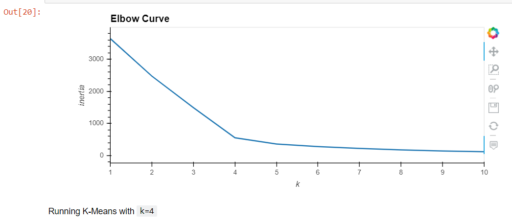
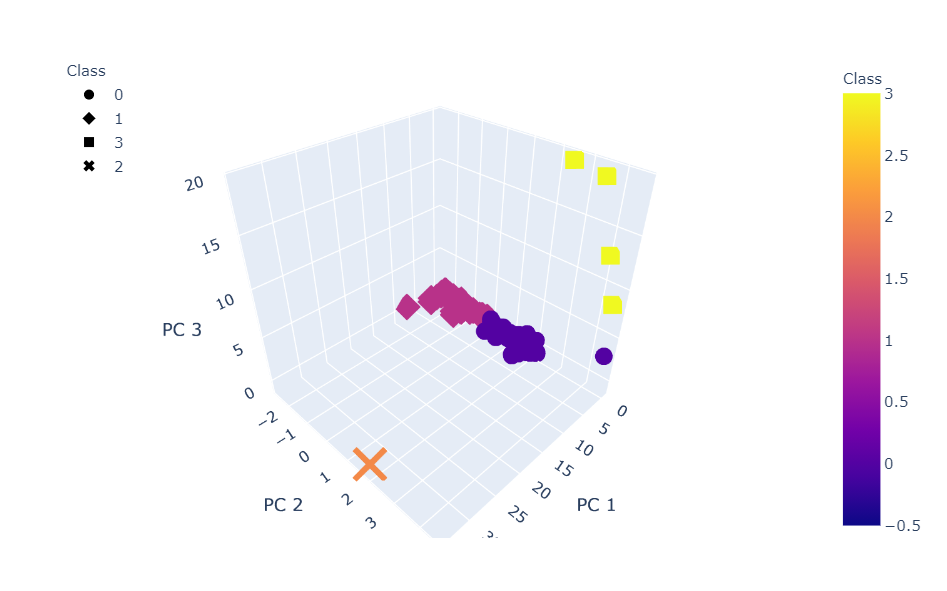
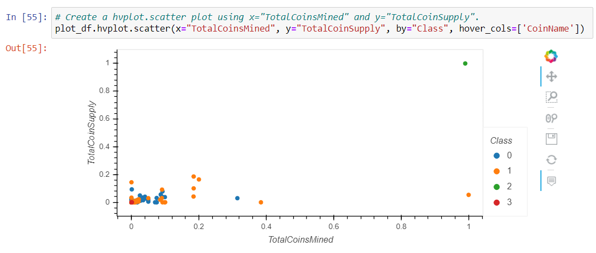

# Cryptocurrencies

## Overview
Our client would like to offer a new cryptocurrency investment portfolio for its customers so we are asked to create a report that includes what cryptocurrencies are on the trading market and how they could be grouped to create a classification system for this new investment. We will use unsupervised learning to process the data and then pass it to machine learning models. To group the cryptocurrencies, we decide on a clustering algorithm. 

## Tasks
- Preprocessing the Data for PCA
- Reducing Data Dimensions Using PCA
- Clustering Cryptocurrencies Using K-means
- Visualizing Cryptocurrencies Results

#Tools used
- Python 3.7

## Result
- Elbow Curve

- 3D Scatter Graph with PCA and clusters

- Sctater Graph 

